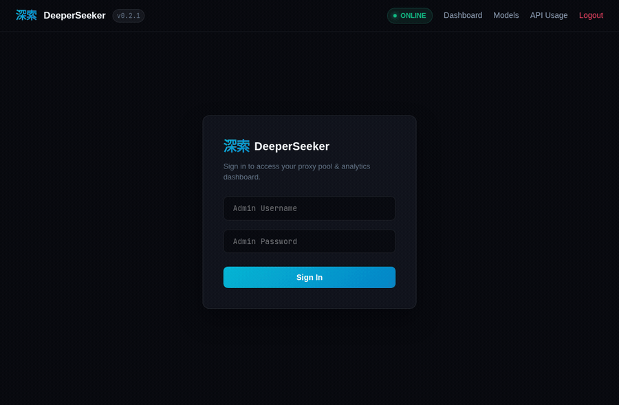

<div align="center">

# ⚡ 深層探求者・DeeperSeeker-RS
### High-Performance DeepSeek Web Reverse Proxy & CLI in Rust

[](https://github.com/Praveensenpai/deeperseeker-rs/releases)
[](https://www.rust-lang.org)
[](https://github.com/tokio-rs/axum)
[](https://github.com/Praveensenpai/deeperseeker-rs)
[](LICENSE)

*Ultra-low latency, memory-efficient reverse proxy bridging DeepSeek's Web API to OpenAI and Claude compatible endpoints.*  
*Rust rewrite of [DeeperSeeker](https://github.com/AmanCode22/deeperseeker) by [AmanCode22](https://github.com/AmanCode22).*

[⚡ Quick Start](#-quick-start) • [🐳 Docker](#-docker-deployment) • [✨ Key Features](#-key-features) • [⚡ Why Rust?](#-why-deeperseeker-rs-rust-vs-python) • [🎥 Showcase](#-usage-showcase) • [🎨 Web Dashboard](#-web-administration-dashboard) • [🔑 DeepSeek Token Setup](#-deepseek-token-setup) • [💻 CLI Ergonomics](#-cli-ergonomics) • [📊 Token Usage Analytics](#-token-usage-analytics) • [🛠️ Admin API](#%EF%B8%8F-token-pool-admin-api) • [🏛️ Architecture](#%EF%B8%8F-architecture) • [🔌 API & Demos](#-api-usage) • [⚠️ Disclaimer](#%EF%B8%8F-disclaimer) • [🙏 Credits](#-acknowledgements--credits)

</div>

---

> [!TIP]
> **Drop-in OpenAI & Claude Protocol · Embedded WebAssembly PoW · Native Token Pool Routing**  
> Turn DeepSeek Web accounts into high-throughput OpenAI (`/v1/chat/completions`) and Claude (`/v1/messages`) endpoints with zero rate-limit thrashing, live TUI telemetry, and granular K/M/B token analytics.

---

## 🚀 Quick Start

### 🪄 One-Liner Magic (Pre-Built Linux x86_64 Binary)

Install `deeperseeker` in seconds with automatic path and asset setup:

```bash
curl -fsSL -H "Cache-Control: no-cache" https://raw.githubusercontent.com/Praveensenpai/deeperseeker-rs/main/install.sh | bash
```

### 🛠️ Build from Source

```bash
# Clone the repository
git clone https://github.com/Praveensenpai/deeperseeker-rs.git
cd deeperseeker-rs

# Compile release binary
cargo build --release

# Run the proxy
./target/release/deeperseeker serve
```

The server listens on `http://127.0.0.1:4000` by default.

### 🐳 Docker Deployment

#### Using Docker Compose (Recommended)

```bash
# Clone the repository
git clone https://github.com/Praveensenpai/deeperseeker-rs.git
cd deeperseeker-rs

# Launch the container in the background
docker compose up -d
```

#### Using Docker CLI Directly

```bash
# Run with persistent volume mount for the SQLite database
docker run -d \
  --name deeperseeker \
  -p 4000:4000 \
  -v deeperseeker_data:/data \
  --restart unless-stopped \
  ghcr.io/praveensenpai/deeperseeker-rs:latest
```

#### 🔄 Updating the Container

To upgrade an existing container to the latest release while keeping your database, tokens, and usage history intact:

```bash
docker rm -f deeperseeker && \
docker pull ghcr.io/praveensenpai/deeperseeker-rs:latest && \
docker run -d \
  --name deeperseeker \
  -p 4000:4000 \
  -v deeperseeker_data:/data \
  --restart unless-stopped \
  ghcr.io/praveensenpai/deeperseeker-rs:latest
```

All credentials and options can be configured via environment variables (`DEEPSEEKER_API_KEY`, `DEEPSEEKER_ADMIN_PASS`, `DEEPSEEKER_REQUEST_GAP`). Request pacing is human-like by default: a 5s base gap with jitter, plus an occasional reading pause (`DEEPSEEKER_REQUEST_GAP_JITTER`, `DEEPSEEKER_HUMAN_PAUSE_CHANCE`, `DEEPSEEKER_HUMAN_PAUSE_MAX`).

---

## 🎥 Usage Showcase

### 🤖 OpenCode Autonomous Coding & Tool Calls
Driving real-time coding sessions in OpenCode via `deeperseeker-rs`:

<div align="center">
  
</div>

<br>

### 🖥️ Interactive TUI Dashboard & Monitor (`deeperseeker status`)
Multi-horizon token telemetry, active upstream token pool status, and diagnostic health checks:

<div align="center">
  
</div>

<br>

### 🎨 Web Administration Dashboard (`/dashboard`)
Dark-mode administration portal with real-time pool metrics, token management, usage breakdown, and a live SSE tail of individual requests:

<div align="center">
  
</div>

<br>

### ⚡ Standalone API Streaming Client
Real-time streaming completions with reasoning blocks via standard OpenAI client libraries:

<div align="center">
  
</div>

---

## 🔑 DeepSeek Token Setup

To route requests through DeepSeek Web, obtain your user authentication token from your browser session:

1. Open [chat.deepseek.com](https://chat.deepseek.com) and sign in.
2. Open Developer Tools (`F12` or `Ctrl+Shift+I` on Linux/Windows, `Cmd+Option+I` on macOS).
3. Switch to the **Console** tab and run:

```javascript
JSON.parse(localStorage.getItem("userToken")).value
```

4. Copy the resulting Bearer token string (starts with `ey...`).
5. Add it directly to your proxy pool via the CLI:

```bash
deeperseeker token add "YOUR_TOKEN_HERE" --label "primary-account"
```

Or paste it into the Web Dashboard at `http://localhost:4000/dashboard`.

---

## ✨ Key Features

- ⚡ **Zero GIL, Blazing Fast**: Engineered with Axum 0.8 and Tokio for asynchronous high-concurrency throughput.
- 🧠 **DeepSeek V4.1 Flash**: Full streaming (SSE) and unary completions support with reasoning/thinking extraction.
- 🔁 **Scheduler v2**: Token pool management with round-robin, least-in-flight concurrency caps, and automatic cooldown recovery.
- 💬 **Conversation Persistence**: Multi-turn conversation signature tracking with upstream parent message pointer chaining.
- 🛡️ **Embedded WASM PoW Solver**: Native execution of DeepSeek's cryptographic Proof-of-Work solver via `wasmtime`.
- 📁 **Vision & File Uploads**: `/v1/files` and `/v1/files/upload` endpoints supporting documents and vision image recognition.
- 🎭 **Claude Messages API**: Drop-in compatibility for Claude Desktop and Cursor via `/v1/messages`.
- 📊 **Usage Analytics Engine**: Token tracking across Today, Yesterday, This Week, Month, Year, and All-Time with K/M/B formatting.
- 🖥️ **Interactive TUI & CLI**: Multi-view Ratatui terminal dashboard, end-to-end diagnostics, and systemd service management.
- 🎨 **Minimal Web Dashboard**: Modern dark-mode interface built with clean typography, live stats, and one-click token copy.
- 🔑 **Per-Client API Keys & Quotas**: Issue hashed downstream keys with rolling-window token quotas, managed from the dashboard (plaintext shown once).
- 🛠️ **Programmatic Token Pool API**: Full JSON CRUD for the upstream pool at `/api/admin/*` — list, add, swap, verify, reset, and delete tokens from scripts, cron, or CI.
- 📈 **Prometheus Metrics**: Hand-rolled `/metrics` exposition for tokens, in-flight requests, and success/error/rate-limit counters.
- 🧮 **Real DeepSeek Tokenizer**: Exact token accounting via the bundled HuggingFace `tokenizer.json`, with a heuristic fallback if the asset is missing.
- 🧹 **Retention & Cleanup**: Configurable automatic pruning of stale sessions and usage history to keep SQLite lean.
- 🛡️ **Hardened Upstream Calls**: Separate connect/read timeouts, graceful shutdown on SIGINT/SIGTERM, and `Retry-After` on 429 responses.

---

## ⚡ Why DeeperSeeker-RS? (Rust vs. Python)

| Feature / Dimension | 🐍 Original Python (`deeperseeker`) | ⚡ Rust (`deeperseeker-rs`) |
| :--- | :--- | :--- |
| **Runtime & Dependencies** | Python 3.10+, `pip`, `venv`, `playwright`, `aiohttp` | **Zero dependencies** (single standalone ~24 MB binary) |
| **Memory Footprint** | ~90 MB – 250 MB+ (up to 500 MB with Playwright) | **~15 MB peak RAM** (negligible memory footprint) |
| **Concurrency & Engine** | Single-threaded `asyncio` bound by Python GIL | Multi-threaded **Tokio worker pool + Axum 0.8** |
| **WASM PoW Solving** | Python FFI to `wasmtime-py` (blocks event loop) | Native `wasmtime` engine run on dedicated worker threads |
| **Agentic Tool Calling** | Basic streaming; DSML XML tags can leak into chat | Dedicated **DSML interceptor** converting to OpenAI `tool_calls` |
| **Stream Resiliency** | Prone to UTF-8 mid-byte slicing panics | **UTF-8 char-boundary alignment** + graceful connection recovery |
| **Terminal Tooling** | Plain console stdout logs only | **Interactive Ratatui TUI** (`status`) + CLI usage tables (`usage`) |
| **Service Integration** | Manual systemd unit or Docker container | Built-in systemd user service installer (`deeperseeker service install`) |

---

## 💻 CLI Ergonomics

Inspired by high-performance developer tooling (`sys-chronicle`, Claude CLI, `uv`), `deeperseeker` provides dedicated subcommands for terminal workflows:

| Command | Description |
| :--- | :--- |
| `deeperseeker serve` | Launch the reverse proxy HTTP server daemon |
| `deeperseeker status` | Interactive Ratatui TUI dashboard or one-shot server status probe |
| `deeperseeker usage` | Print structured token usage table, daily histogram, and model stats |
| `deeperseeker token list` | Inspect all tokens in the SQLite pool with masked values and status |
| `deeperseeker token add <TOKEN>` | Register a new DeepSeek Web Bearer token |
| `deeperseeker token edit <ID> [-t TOKEN] [-a ALIAS]` | Update a token's alias or swap its credential (verified upstream before saving) |
| `deeperseeker token remove <ID>` | Delete a token and its usage history from the pool |
| `deeperseeker token reset <ID>` | Clear a token's recorded usage and cached sessions without deleting it |
| `deeperseeker token test [ID]` | Test upstream authentication validity across all registered tokens |
| `deeperseeker test` | Execute 4-tier diagnostics: SQLite DB, WASM PoW solver, DeepSeek API, Proxy |
| `deeperseeker service install` | Generate and enable a systemd user service (`deeperseeker.service`) |
| `deeperseeker service status` | Query systemd service status |
| `deeperseeker update` | Download and install the latest release binary from GitHub |

### Interactive TUI Dashboard (`deeperseeker status`)

Run `deeperseeker status` in any terminal to launch the interactive Ratatui dashboard:

- **Tab 1: Overview Monitor** — Live proxy status, uptime, address, and summary cards.
- **Tab 2: Token Analytics** — Clean box-table with K/M/B metrics across all time horizons.
- **Tab 3: Token Pool** — Registered accounts, mask signatures, and active load status.
- **Tab 4: Multi-Probe Diagnostics** — Real-time health checks on Database, WASM PoW, Upstream API, and Local Port.

Press `q` or `Esc` to exit, `Tab` to switch views, and `r` to refresh. Use `--plain` for headless scripting.

<div align="center">
  
</div>

---

## 📊 Token Usage Analytics

Track exact input and output token consumption aggregated across all OpenAI and Claude requests.

```bash
deeperseeker usage
```

Outputs a clean, human-readable terminal table formatted with **K, Million, and Billion** metrics:

```text
┌────────────────────────────────────────────────────────────────────────┐
│                        TOKEN USAGE SUMMARY                             │
├─────────────┬──────────┬──────────────┬──────────────┬─────────────────┤
│ Period      │ Requests │ Input Tokens │ Output Total │ Total Tokens    │
├─────────────┼──────────┼──────────────┼──────────────┼─────────────────┤
│ Today       │ 14       │ 12.48K       │ 4.92K        │ 17.40K          │
│ Yesterday   │ 38       │ 45.21K       │ 18.34K       │ 63.55K          │
│ This Week   │ 112      │ 182.40K      │ 71.20K       │ 253.60K         │
│ This Month  │ 340      │ 520.10K      │ 198.40K      │ 718.50K         │
│ This Year   │ 1.28K    │ 2.14M        │ 840.10K      │ 2.98M           │
│ All Time    │ 1.28K    │ 2.14M        │ 840.10K      │ 2.98M           │
└─────────────┴──────────┴──────────────┴──────────────┴─────────────────┘

  Daily Activity (Last 14 Days)
  2026-10-02  ▇▇▇▇▇▇▇▇▇▇▇▇▇▇▇▇▇▇▇▇  63.55K
  2026-10-03  ▇▇▇▇▇                 17.40K

  Model Distribution
  v4.1flash: 52 requests (80.95K tokens)
```

Use `--raw` to view unformatted integers, or fetch programmatic JSON via:

```bash
curl http://127.0.0.1:4000/v1/usage -H "Authorization: Bearer dseeker"
```

---

## 🏛️ Architecture

```text
                   ┌────────────────────────────────────────┐
                   │    Client (OpenAI / Claude / Cursor)   │
                   └───────────────────┬────────────────────┘
                                       │ HTTP / SSE
                                       ▼
        ┌──────────────────────────────────────────────────────────────┐
        │                       deeperseeker-rs                        │
        │                                                              │
        │  ┌──────────────────┐  ┌────────────────┐  ┌──────────────┐  │
        │  │ OpenAI /v1/chat  │  │ Claude /v1/msg │  │  /dashboard  │  │
        │  └────────┬─────────┘  └───────┬────────┘  └──────┬───────┘  │
        │           │                    │                  │          │
        │           ▼                    ▼                  ▼          │
        │  ┌────────────────────────────────────────────────────────┐  │
        │  │  Scheduler v2 (Least In-Flight, Token Pool, Rate Limit)│  │
        │  └─────────────────────────────┬──────────────────────────┘  │
        │                                │                             │
        │  ┌─────────────────────────────┴──────────────────────────┐  │
        │  │  WASM PoW Engine (Embedded wasmtime Proof of Work)     │  │
        │  └─────────────────────────────┬──────────────────────────┘  │
        │                                │                             │
        │  ┌─────────────────────────────┴──────────────────────────┐  │
        │  │  Usage Engine (SQLite Token Accounting & Aggregations) │  │
        │  └─────────────────────────────┬──────────────────────────┘  │
        └────────────────────────────────┼─────────────────────────────┘
                                         │ Upstream Android API
                                         ▼
                             ┌───────────────────────┐
                             │   chat.deepseek.com   │
                             └───────────────────────┘
```

---

## ⚙️ Configuration (.env)

| Variable | Default | Description |
| :--- | :--- | :--- |
| `DEEPSEEKER_PORT` | `4000` | Port to bind proxy server |
| `DEEPSEEKER_HOST` | `0.0.0.0` | Bind host interface |
| `DEEPSEEKER_API_KEY` | `dseeker` | Bearer token for client API requests |
| `DEEPSEEKER_ADMIN_USER` | `admin` | Web dashboard username |
| `DEEPSEEKER_ADMIN_PASS` | `admin` | Web dashboard password |
| `DEEPSEEKER_DB_PATH` | `deeperseeker.db` | SQLite database file path |
| `DEEPSEEKER_WASM_PATH` | `wasm/deepseek_pow_solver.wasm` | Path to PoW WebAssembly solver |
| `DEEPSEEKER_TOKEN_CONCURRENCY` | `8` | Max concurrent in-flight requests per token |
| `DEEPSEEKER_COOKIE_COOLDOWN` | `20` | Cooldown seconds after a rate-limited token |
| `DEEPSEEKER_REQUEST_GAP` | `5.0` | Base pacing gap (seconds) between upstream calls |
| `DEEPSEEKER_REQUEST_GAP_JITTER` | `2.0` | Random jitter added to the pacing gap |
| `DEEPSEEKER_HUMAN_PAUSE_CHANCE` | `0.05` | Probability of an extra human-like pause |
| `DEEPSEEKER_HUMAN_PAUSE_MAX` | `10.0` | Maximum extra pause duration (seconds) |
| `DEEPSEEKER_SUSPEND_PROBE_INTERVAL_HOURS` | `6` | Interval for probing suspended tokens |
| `DEEPSEEKER_UPSTREAM_TIMEOUT_SECS` | `300` | Per-read upstream timeout (streaming-safe) |
| `DEEPSEEKER_UPSTREAM_CONNECT_TIMEOUT_SECS` | `15` | Upstream TCP connect timeout |
| `DEEPSEEKER_SESSION_RETENTION_DAYS` | `30` | Days to keep cached sessions (`0` = keep forever) |
| `DEEPSEEKER_USAGE_RETENTION_DAYS` | `0` | Days to keep usage rows (`0` = keep forever) |

---

## 📈 Observability & Client Keys

### Prometheus Metrics

The public `/metrics` endpoint exposes Prometheus text exposition:

```bash
curl http://127.0.0.1:4000/metrics
```

Series include `deeperseeker_up`, `deeperseeker_build_info`, `deeperseeker_tokens_total`, `deeperseeker_tokens_active`, `deeperseeker_in_flight_requests`, `deeperseeker_requests_total`, `deeperseeker_requests_success_total`, `deeperseeker_requests_error_total`, and `deeperseeker_requests_rate_limited_total`.

### Per-Client API Keys

The master `DEEPSEEKER_API_KEY` grants unlimited access. To issue a quota-limited key, open the dashboard and use the **Client API Keys** card:

- Keys are shown **once** at creation and stored only as SHA-256 hashes.
- Each key has an optional **rolling-window token quota** (per day / week / month / all time); `0` means unlimited.
- Exhausted keys receive `429 Too Many Requests` with a `Retry-After` header.
- Keys can be revoked or deleted at any time from the dashboard.

### 🛠️ Token Pool Admin API

Manage the upstream DeepSeek token pool programmatically over JSON. Every route requires the master `DEEPSEEKER_API_KEY` as a `Bearer` token; per-client keys are rejected. Raw credentials are never returned — reads expose only the masked form.

| Method | Endpoint | Description |
| :--- | :--- | :--- |
| `GET` | `/api/admin/pool` | Pool summary: total, active, rate-limited, expired, in-flight |
| `GET` | `/api/admin/tokens` | List all tokens (masked) with aggregated usage |
| `GET` | `/api/admin/tokens/{id}` | Single token detail |
| `POST` | `/api/admin/tokens` | Add a token (`auth_token`, optional `alias`) |
| `PATCH` | `/api/admin/tokens/{id}` | Update alias and/or swap credential (verified upstream) |
| `DELETE` | `/api/admin/tokens/{id}` | Delete token + cascade sessions/usage |
| `POST` | `/api/admin/tokens/{id}/verify` | Probe upstream, set `ACTIVE` or `EXPIRED` |
| `POST` | `/api/admin/tokens/{id}/reset` | Clear usage history + cached sessions |
| `POST` | `/api/admin/tokens/{id}/status` | Force status (`ACTIVE` or `EXPIRED`) |

```bash
AUTH="Authorization: Bearer $DEEPSEEKER_API_KEY"
BASE="http://127.0.0.1:4000"
```

#### 🔍 Inspect the pool

```bash
# Summary counters: total / active / rate_limited / expired / in_flight
curl -s $BASE/api/admin/pool -H "$AUTH"
# {"status":"ok","pool":{"total":2,"active":1,"rate_limited":1,"expired":0,"in_flight":3}}

# Every token (masked) with aggregated usage
curl -s $BASE/api/admin/tokens -H "$AUTH"
# {"status":"ok","tokens":[{"id":1,"alias":"primary","masked_token":"eyJhbGciOiJI…7890",
#   "status":"ACTIVE","usage":{"requests":42,"total_tokens":184320}}]}

# One token by id
curl -s $BASE/api/admin/tokens/1 -H "$AUTH"
```

#### ➕ Add & update

```bash
# Add — surrounding quotes/whitespace are trimmed automatically
curl -s -X POST $BASE/api/admin/tokens -H "$AUTH" -H "Content-Type: application/json" \
  -d '{"auth_token": "ey...", "alias": "primary"}'

# Rename only (no upstream call)
curl -s -X PATCH $BASE/api/admin/tokens/1 -H "$AUTH" -H "Content-Type: application/json" \
  -d '{"alias": "backup"}'

# Swap the credential — verified upstream before saving, else 502 + marked EXPIRED
curl -s -X PATCH $BASE/api/admin/tokens/1 -H "$AUTH" -H "Content-Type: application/json" \
  -d '{"auth_token": "ey-new..."}'
```

#### 🩺 Health, status & cleanup

```bash
# Probe upstream validity → ACTIVE or EXPIRED
curl -s -X POST $BASE/api/admin/tokens/1/verify -H "$AUTH"

# Force status (ACTIVE | EXPIRED)
curl -s -X POST $BASE/api/admin/tokens/1/status -H "$AUTH" -H "Content-Type: application/json" \
  -d '{"status": "active"}'

# Clear usage history + cached sessions, keep the token
curl -s -X POST $BASE/api/admin/tokens/1/reset -H "$AUTH"

# Delete the token and cascade its usage/sessions
curl -s -X DELETE $BASE/api/admin/tokens/1 -H "$AUTH"
```

#### 🐍 Scripted workflow

Verify every token and retire the dead ones — run it from cron or CI:

```bash
AUTH="Authorization: Bearer $DEEPSEEKER_API_KEY"
BASE="http://127.0.0.1:4000"
for id in $(curl -s $BASE/api/admin/tokens -H "$AUTH" | jq -r '.tokens[].id'); do
  curl -s -X POST $BASE/api/admin/tokens/$id/verify -H "$AUTH"
done
```

All responses are JSON. Errors use `{"error": {"message", "type"}}`:

| Status | Meaning |
| :--- | :--- |
| `401` | Missing or invalid master key (client keys are rejected) |
| `400` | Bad input (empty `auth_token`, unknown `status`) |
| `404` | Token id not found |
| `502` | Credential swap failed upstream verification |

Credentials are never echoed back — reads expose only the masked form.

---

## 🔌 API Usage

### OpenAI Chat Completions

```bash
curl http://127.0.0.1:4000/v1/chat/completions \
  -H "Authorization: Bearer dseeker" \
  -H "Content-Type: application/json" \
  -d '{
    "model": "v4.1flash",
    "messages": [{"role": "user", "content": "Explain Rust ownership in 2 sentences."}],
    "stream": true
  }'
```

### 🤖 OpenCode Setup

Configure `deeperseeker-rs` as a custom provider in `~/.config/opencode/opencode.json`:

```json
{
  "$schema": "https://opencode.ai/config.json",
  "model": "deeperseeker/v4.1flash",
  "provider": {
    "deeperseeker": {
      "npm": "@ai-sdk/openai-compatible",
      "name": "DeeperSeeker Gateway",
      "options": {
        "baseURL": "http://127.0.0.1:4000/v1",
        "apiKey": "dseeker"
      },
      "models": {
        "v4.1flash": {
          "name": "DeepSeek V4.1 Flash",
          "attachment": true,
          "modalities": {
            "input": ["text", "image"],
            "output": ["text"]
          }
        },
        "v4.1flash-think": {
          "name": "DeepSeek V4.1 Flash (Deep Think)",
          "attachment": true,
          "reasoning": true,
          "modalities": {
            "input": ["text", "image"],
            "output": ["text"]
          }
        },
        "v4.1flash-search": {
          "name": "DeepSeek V4.1 Flash (Web Search)",
          "attachment": true,
          "modalities": {
            "input": ["text", "image"],
            "output": ["text"]
          }
        },
        "v4.1flash-think-search": {
          "name": "DeepSeek V4.1 Flash (Think + Search)",
          "attachment": true,
          "reasoning": true,
          "modalities": {
            "input": ["text", "image"],
            "output": ["text"]
          }
        },
        "anthropic/claude-v4.1flash": {
          "name": "Claude V4.1 Flash",
          "attachment": true,
          "reasoning": true,
          "modalities": {
            "input": ["text", "image"],
            "output": ["text"]
          }
        }
      }
    }
  }
}
```

Then run OpenCode in any project directory and switch models via <kbd>Ctrl+P</kbd>:

```bash
opencode
```

### 📋 Supported Model Identifiers (`/v1/models`)

DeeperSeeker-RS serves DeepSeek Web through a unified model pipeline:

| Model | Capabilities | Recommended Use |
| :--- | :--- | :--- |
| **`v4.1flash`** | 🟢 Standard Fast | Coding, agent loops & fast chat (Default) |
| **`v4.1flash-think`** | 🧠 Deep Think | Complex logic, algorithm design & math reasoning |
| **`v4.1flash-search`** | 🌐 Web Search | Real-time news, fresh documentation & external lookups |
| **`v4.1flash-think-search`** | 🧠 Deep Think + 🌐 Web Search | Comprehensive reasoning backed by live internet research |
| **`anthropic/claude-v4.1flash`** | 🟢 Claude Drop-in | Claude CLI & Claude Desktop `/v1/messages` endpoint |

### Claude Desktop & Cursor Integration

Add to your `claude_desktop_config.json`:

```json
{
  "apiEndpoints": {
    "anthropic": {
      "baseUrl": "http://127.0.0.1:4000",
      "apiKey": "dseeker"
    }
  }
}
```

### 🧪 Demo Projects & Client Examples

Run the bundled demonstration clients right out of the repository:

#### Python Streaming Client (`uv run`)
Standalone script utilizing PEP 723 inline dependency metadata (`openai`, `rich`):

```bash
uv run examples/demo_client.py "In 2 bullet points, why is Rust fast?"
```

#### Rust Native Client (`cargo run`)
Native async streaming client using `reqwest` and `tokio`:

```bash
cargo run --example demo_stream "In 2 sentences, what is Tokio?"
```

---

## 🎨 Web Administration Dashboard

DeeperSeeker includes a dark-mode web management interface accessible locally or across your LAN / Tailscale network:

- **Local Workstation**: `http://localhost:4000/dashboard`
- **Remote Host / Server**: `http://mochi:4000/dashboard` *(or `http://<server-ip>:4000/dashboard`)*

<div align="center">
  
</div>

<br>

```text
┌────────────────────────────────────────────────────────────────────────┐
│  ⚡ DEEPERSEEKER WEB GATEWAY DASHBOARD                                │
├───────────────┬─────────────────┬────────────────────┬─────────────────┤
│ Pool Health   │ Concurrency     │ Today's Tokens     │ Gateway Port    │
│  1 / 1 Active │  0 In-Flight    │  1.60M Aggregated  │  :4000/v1       │
└───────────────┴─────────────────┴────────────────────┴─────────────────┘
┌────────────────────────────────────────────────────────────────────────┐
│  🔑 Add DeepSeek Auth Token                                            │
│  [ Copy Extraction Snippet ]  JSON.parse(localStorage.getItem(...))    │
│  [ Alias (e.g. primary) ] [ Paste ey... token ] [ Add to Pool ]        │
└────────────────────────────────────────────────────────────────────────┘
┌────────────────────────────────────────────────────────────────────────┐
│  📊 Token Usage Summary (Today, Yesterday, Week, Month, Year, All-Time)│
│  Today: 318 Requests · 1.59M Input · 8.9K Output · 1.60M Total Tokens  │
└────────────────────────────────────────────────────────────────────────┘
```

### 🔐 Authentication & Credentials
Visiting `/dashboard` unauthenticated redirects to `/login`:
- **Default Username**: `admin`
- **Default Password**: `admin`

Configure production credentials via `.env` or systemd environment:

```bash
DEEPSEEKER_ADMIN_USER="admin"
DEEPSEEKER_ADMIN_PASS="your-secure-password"
DEEPSEEKER_SESSION_SECRET="random-32-char-secret"
```

### 🌟 Dashboard Capabilities
- **⚡ Live Concurrency Counter**: Real-time counter of active upstream streaming requests.
- **🔑 In-Browser Token Extraction**: Built-in 1-click button to copy the browser DevTools extraction snippet and add tokens directly without restarting the daemon.
- **🛡️ Token Pool State Monitor**: Visual badges for token accounts (`ACTIVE`, `RATE_LIMITED`, `COOLDOWN`) with masked keys and one-click revocation.
- **📊 Granular Usage Breakdown**: Human-readable K/M/B summaries with raw integer hover tooltips across all time horizons.
- **📡 Live Request Logs**: Server-sent event tail of the last 100 requests showing full input prompt, streamed output, reasoning blocks, token counts, duration, and finish reason in real time.

---

## ⚠️ Disclaimer

> [!CAUTION]
> **Educational & Personal Research Only**  
> DeeperSeeker-RS is an independent, open-source reverse-proxy gateway created strictly for interoperability research, local benchmarking, and personal educational use. It is **not** an official product of, affiliated with, endorsed by, or sponsored by DeepSeek Inc.  
> 
> Users are solely responsible for ensuring their usage complies with DeepSeek's Terms of Service, Acceptable Use Policies, and all applicable privacy and security regulations. The maintainers and contributors assume no responsibility or liability for account suspensions, service disruptions, or any damages arising from the use or misuse of this software.

---

## 🙏 Acknowledgements & Credits

This project is a high-performance Rust reimplementation built on the reverse-engineering foundation established by the open-source community:

- **[AmanCode22](https://github.com/AmanCode22)**: Creator of the original [DeeperSeeker](https://github.com/AmanCode22/deeperseeker) (Python/FastAPI) and the [DeepSeek PoW Solver](https://github.com/AmanCode22/deepseek_pow_solver) WebAssembly module used to calculate proof-of-work challenges.
- **[alan7383](https://github.com/alan7383)**: Contributor who identified the Android client header bypass, eliminating the need for headless browser automation.

---

## 📜 License

Licensed under the MIT License. Educational and personal research purposes only.  
© Praveen Senpai ([@Praveensenpai](https://github.com/Praveensenpai))
